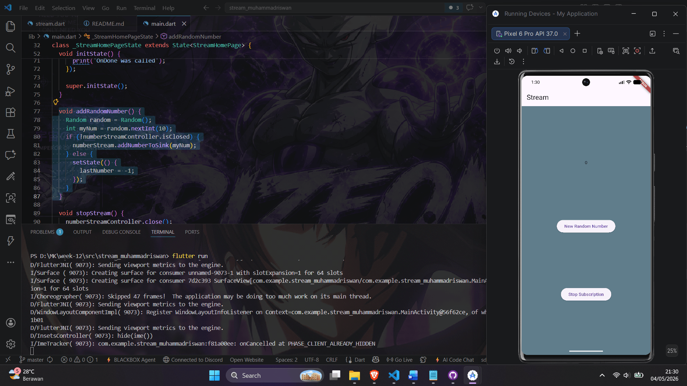
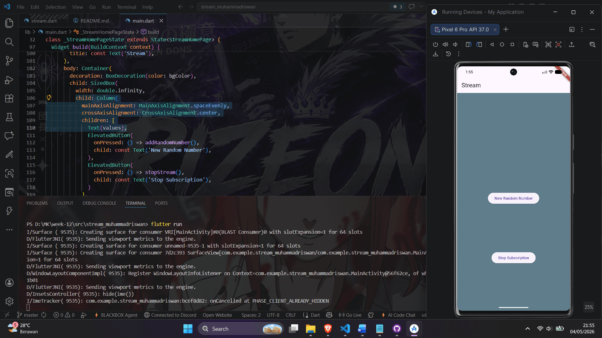

# Stream Muhammad Riswan - Week 12 Praktikum Soal 4 & 6

## Hasil Praktikum Soal 4
Flutter app with StreamBuilder consuming ColorStream for periodic background color changes.

## Hasil Praktikum Soal 6
NumberStream with StreamController, sink/addNumberToSink, listener UI with random button.

## Hasil Praktikum Soal 9-11
Full Stream app: broadcast stream (.asBroadcastStream()), multiple listeners append to values string, UI Text(values) showing duplicated events, safe close + lifecycle.

**Soal 10-11:** Broadcast stream demo - multiple subscriptions share events w/o crash, UI accumulates "event - event - ..." (x2 listeners).
