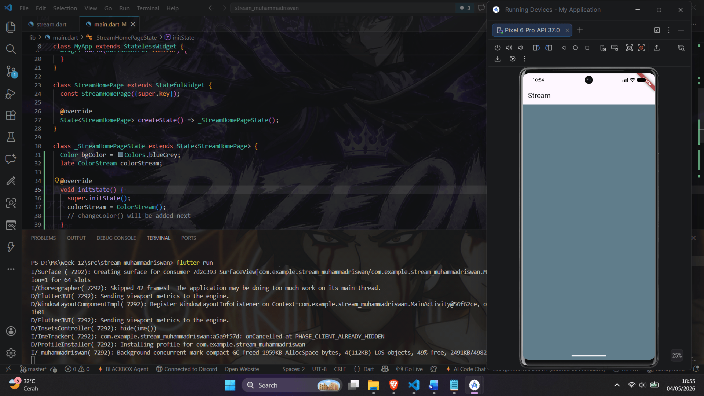
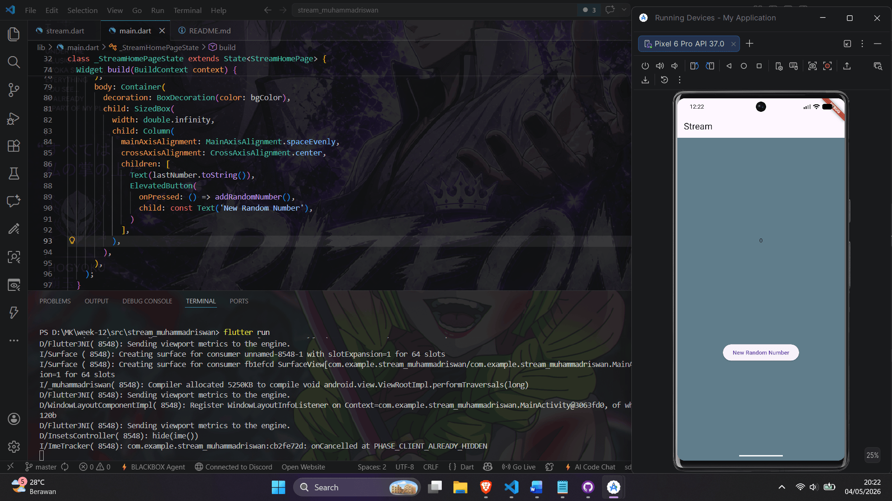
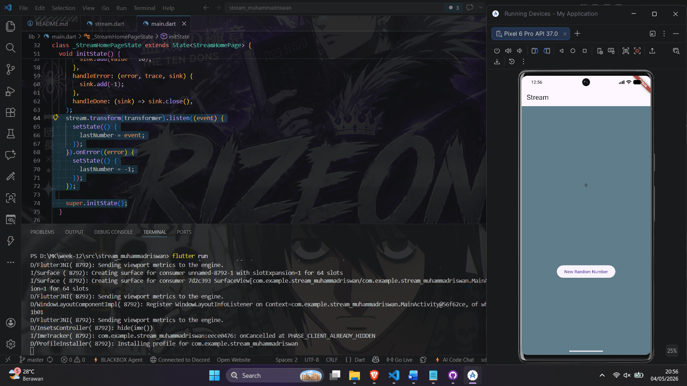

# Stream Muhammad Riswan - Week 12 Praktikum Soal 4 & 6

## Hasil Praktikum Soal 4
Flutter app with StreamBuilder consuming ColorStream for periodic background color changes.

## Hasil Praktikum Soal 6
NumberStream with StreamController, sink/addNumberToSink, listener UI with random button.

## Getting Started

This project is a starting point for a Flutter application.

A few resources to get you started if this is your first Flutter project:

- [Learn Flutter](https://docs.flutter.dev/get-started/learn-flutter)
- [Write your first Flutter app](https://docs.flutter.dev/get-started/codelab)
- [Flutter learning resources](https://docs.flutter.dev/reference/learning-resources)

For help getting started with Flutter development, view the
[online documentation](https://docs.flutter.dev/), which offers tutorials,
samples, guidance on mobile development, and a full API reference.
